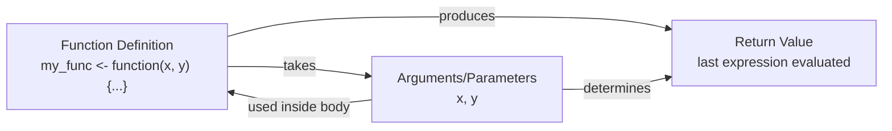

::::::::::::::::::::::::::::::::::::::: objectives

_After following this episode, learners will be able to..._

- Appreciate how the use of relevant technical terminology in a prompt can influence the style and accuracy of the response generated.
- Identify some strategies to help them build a useful mental model of coding.

::::::::::::::::::::::::::::::::::::::::::::::::::

:::::::::::::::::::::::::::::::::::::::: questions

- How can I get explanations when I don't understand or recognise something?
- What can I do to reinforce my learning?

::::::::::::::::::::::::::::::::::::::::::::::::::

At the end of the previous episode, we mentioned that the responses you receive when you ask questions are likely to refer to unfamiliar concepts and terms as you learn to code.
These moments are great opportunities to keep learning!
How can we make best use of the chatbot to help us build our knowledge and skills?

## Terminology
Like any specialism, software development has its fair share of technical jargon.
Getting oriented with the terminology takes effort but can be very helpful.
Just like when composing search terms to maximise the chances of finding what you are looking for, including the appropriate technical terms in your prompts to a chatbot will increase the likelihood that the response generated is specific, relevant, and helpful.

:::::::::::::::::::::::::::::::::::::::: challenge

### Choose Your Words Carefully
In a new chat, prompt your chatbot with the following question:

> What is a vector?

If the response generated explains vectors as a mathematical concept, follow up to specify that you are interested in learning about vectors in programming.

> What is a vector in programming?

Then, even more specifically:

> What is a vector in R?

Can you follow the explanation provided in the response generated from this prompt? 
Make a list of every technical term in the explanation and split that list into three categories: those terms/concepts that you feel you already understand well; those that you feel you understand a little; and those that you have not encountered before/have no understand of.

::::::::::::::::::::::::::::::::::::::::::::::::::

### Avoid Rabbit Holes
Chatbot responses will often include follow-up questions to narrow down queries that are too general.
It can be helpful to answer these but you should use your own judgement to decide whether or not they will take you in the direction you want to go with your learning.
It is very easy to go too deep on this kind of exploration, especially when you are first starting out.
This can result in a sense of becoming overwhelmed by so much new information, and/or losing sight of what you wanted to learn about in the first place.

As a novice, it can be difficult to tell the difference between something that would be helpful to know at this stage of learning (vectors can only contain one type of data) and the things that are too much information right now (elements in a character vector are pointers to R's global string cache).
You may find that you need to keep "reminding" your chatbot about your current level of expertise in order to keep the responses pitched to the right level.
It can also help to ask "is understanding [technical term] necessary for me to keep learning right now?" or similar -- or ask a friend or colleague the same question to help guide your learning.

:::::::::::::::::::::::::::::::: callout

### Ask for Feedback
After some back-and-forth with a chatbot, you may also find it instructive to ask it how you could be using it better.
This will cause the model to analyse the history of prompts and responses, and produce output that aims to capture points of friction/inefficiency and discuss how you could adjust your approach to avoid similar situations in the future.
Depending on the chatbot and how you have it configured, it might be able to do this kind of analysis across all of the conversations you have had with it.

::::::::::::::::::::::::::::::::::::::::

### Reinforce Your Learning
You are unlikely to develop your own expertise if you limit yourself to only asking for explanations and reading/listening to the responses you receive.
Relatively passive use of AI can lead to [_"the illusion of competence"_](https://psycnet.apa.org/doiLanding?doi=10.1037%2F0278-7393.31.2.187): a false confidence in one's understanding and ability.
[As Barba and Stegner explain](https://arxiv.org/html/2601.10691v1):

> It is a form of metacognitive miscalibration: in the presence of the answer, students misjudge their future performance, they have the feeling that they are learning, but in fact they are not.
> The same can happen with other forms of passive engagement, like sitting in a lecture, or reading and highlighting notes or the textbook. 
> But the effect is more severe with AI tools, because they so drastically increase a person's capacity to complete certain tasks with minimal engagement.

A better strategy to build your own skills is pursuing _guided practice_: applying your new knowledge and skills immediately and adjusting your approach based on targeted, constructive feedback.
One way to access this guidance is to participate in interactive training settings like this workshop.
Another is to engage in regular discussions with experts among your colleagues and peers.
You can also adjust your prompts to influence the way that your chatbot provides new information to you.

#### Practice, Practice, Practice
We present you frequent exercises throughout this workshop because they are an excellent way for you to practice and get feedback as you learn.
But time is usually in short supply at training events and you may be required to move on before you had enough practice to really reinforce your learning.
Chatbots can generate a practically endless supply of exercises to test your understanding and skills around a given topic.

:::::::::::::::::::::::::::::::::::::::::::::::::: challenge

### Asking for Exercises
Choose a new concept you have been introduced to in this lesson, which you would like to learn more about.
For example, for loops, function definitions, or loading packages in R.
Ask your chatbot to generate three exercises to test your understanding of that concept.
E.g.

> Challenge me with three 'two truths and a lie' exercises about loading packages into an R session with the library function.

Now, instead of solving the exercises it produces (save them for later if you like!), give feedback and additional information to the chatbot to help you refine your prompt so that it is most likely to produce exercises that:

* Are appropriate to your level of expertise e.g. do not require additional concepts or skills that you have not yet encountered.
* Increase in difficulty.
* Vary in format e.g. not all multiple-choice questions.

::::::::::::::::::::::::::::::: solution

An example prompt that worked well for the lesson developers:

> You are an expert instructor providing training in programming. 
> I am an early career researcher and novice programmer, who wants to learn enough coding in R to be able to analyse my research data. 
> So far I have encountered some basic scripting: loading data, plotting from a dataframe with ggplot2, looping through unique values in a column, defining and calling a function.
> Generate three exercises to help me expand and reinforce my understanding of function definitions. 
> Do not use any concepts that I am not already familiar with, except where you want me to learn about it through the exercise itself. 
> Each exercises should be slightly more difficult than the last, and the format of the exercises should vary i.e. not three multiple-choice questions in a row. 
> Wait for me to provide my solution to an exercise and, if I get it wrong, give short hints or ask Socratic questions one at a time, to help me figure out where I went wrong.
> Do not give me the answer unless I say "I give up". 

::::::::::::::::::::::::::::::::::::::::

::::::::::::::::::::::::::::::::::::::::::::::::::::::::::::

The important thing is to spend time thinking about and completing these exercises.
If you get stuck, ask your chatbot to provide hints or ask additional questions without ever giving away the solution altogether.
Similarly, before you give your answer to check whether it is correct, make sure that you instruct the chatbot not to provide the correct solution if you got it wrong.

### Metacognition
_Metacognition_ is a learner's awareness that they are learning.
This awareness itself can promote learning, for example by providing additional motivation to continue.
Finding opportunities to reflect on how much you have learned is a great way to reinforce that learning and encourage yourself to keep going.

For example, you might try writing a list of all of the concepts, functions, and practices that you have learned about. 
Or you could draw a concept map, e.g.

:::::::::::::::::::::::::::::::: callout

### What is a Concept Map?
In a concept map, concepts are draw as bubbles and connected together by lines describing the relationship(s) between those concepts.
They are one way to represent our mental model of a domain, system or process.
Just like any map, they do not have to be exhaustive to be useful.

::::::::::::::::::::::::::::::::::::::::

If you do draw a concept map or create some other summary of your understanding, a great next step would be to share that with somebody who can give you feedback on what could be corrected or improved in your mental model, and suggestion about what to learn next.
Many chatbots are able to process images, so you could also prompt yours for this kind of guidance.

:::::::::::::::::::::::::::::::::::::::::::::::::: challenge

### Map Your Progress
Draw a concept map of (some of) the things you have learned so far in this workshop.
If you have time, annotate your diagram to highlight the points where you want to test/deepen your understanding.

::::::::::::::::::::::::::::::::::::::::::::::::::::::::::::

:::::::::::::::::::::::::::::: keypoints

- Being specific about what you know already and what exactly you need to be explained will increase your chances of getting a helpful response.
- Avoid the illusion of competence by putting your knowledge and skills into practice instead of passively consuming responses from a chatbot.

::::::::::::::::::::::::::::::::::::::::
